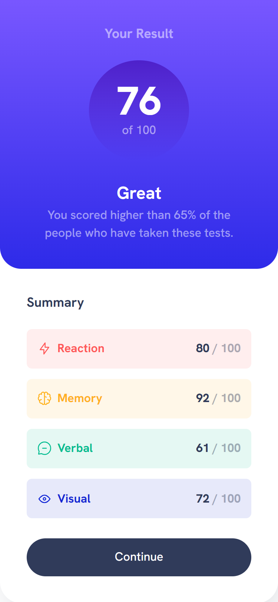

# Frontend Mentor - Results summary component solution

This is a solution to the [Results summary component challenge on Frontend Mentor](https://www.frontendmentor.io/challenges/results-summary-component-CE_K6s0maV).

## Table of Contents

- [Overview](#overview)
  - [Screenshot](#screenshot)
  - [Links](#links)
- [My Process](#my-process)
  - [Built With](#built-with)
- [Author](#author)

## Overview

This blog preview card solution presented here showcases a sleek and responsive design.

### Screenshot

- Desktop View Screenshot: 
- Mobile View Screenshot: 

### Links

- Solution URL: [https://github.com/itzvikashgupta/result-summary-component]
- Live Site URL: [https://result-summary-component-soln.netlify.app/]

## My Process

Here's a breakdown of the steps I took to create this solution:

- Analyzed the design requirements.
- Created necessary files such as `style.css`.
- Structured the content using HTML.
- Established base styles, including font family and size.
- Applied styles as needed for a visually appealing result.

### Built With

- Semantic HTML5 markup
- CSS custom properties
- CSS Flex
- CSS Grid
- Followed a desktop-first workflow

## Author

- Instagram - [@itzvikashgupta](https://www.instagram.com/itzvikashgupta)
- Frontend Mentor - [@itzvikashgupta](https://www.frontendmentor.io/profile/itzvikashgupta)
- Twitter - [@itzvikashgupta](https://www.twitter.com/itzvikashgupta)
